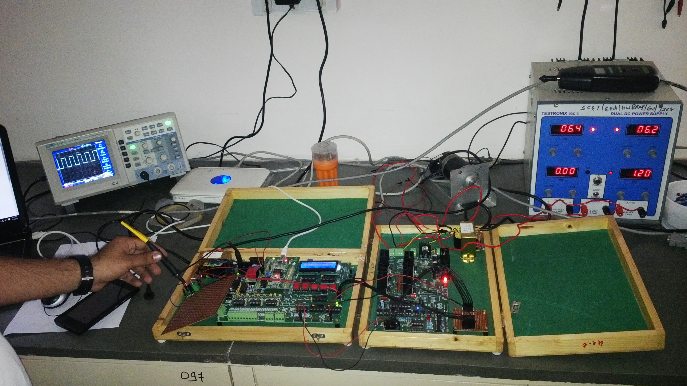

# Bachelor Thesis
The repository contains an overview of my bachelor thesis. Topic: Ethernet interface for electrical drive control

# Ethernet interface for electrical drive control
## Abstract
There is a great problem of monitoring and analyzing the running industrial equipment from remoter areas. Although there are some solutions which use PLC-SCADA systems but due to its high initial cost its only suitable for high end applications. Our main goal is to provide the same solution which should be economical. So with this reference we trying to control BLDC motor through Ethernet connectivity with the help of microcontroller. With this solution one can easily monitor and control various motor's parameters using simple user interface through Ethernet.

## Overview

## Practical Setup

## Algorithm

## GUI

